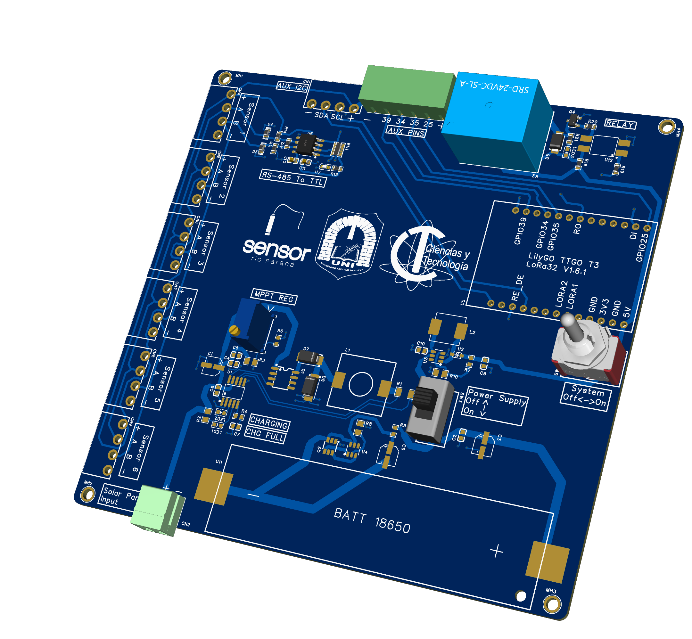

# Solar-Powered LoRa32 Prototype for Water Monitoring

> Follow-up hardware prototype developed as a later phase of a low-cost water-quality monitoring research line.

## Overview

This prototype was designed as a second hardware iteration following a 2024 research project on low-cost sensor-based water-quality data acquisition.

The main objective was to integrate solar-powered lithium-battery charging and provide a physical platform for a LilyGO LoRa32 module and additional sensing components.

## My contribution

- Designed the hardware prototype and PCB.
- Integrated a solar-panel charging subsystem for lithium batteries.
- Integrated the physical footprint and connections for a LilyGO LoRa32 module.
- Assembled the PCB and installed the planned electronic components.
- Performed initial validation of the solar charging and battery-power subsystem.

## Hardware features

- Solar panel input
- Lithium battery charging and power supply
- LilyGO LoRa32 module integration
- Interfaces for additional electronic and sensing components

## Validation status

| Subsystem | Status |
|---|---|
| PCB fabrication | Completed |
| Component assembly | Completed |
| Solar-panel battery charging | Initially tested |
| Lithium-battery power subsystem | Initially tested |
| LilyGO LoRa32 physical integration | Completed |
| LoRa communication | Not tested / not validated |
| Additional components and sensors | Installed but not functionally tested |
| Full system operation | Not validated |

## Project status

**Fabricated and partially validated prototype.**

The charging subsystem was used to charge lithium batteries from solar panels. The LilyGO LoRa32 module and other planned components were installed; however, complete functional testing of the LoRa communication, sensors, and the full monitoring system was not performed.

## Relationship to previous work

This prototype was developed after the 2024 water-quality monitoring research project. It was not included in the related publication.

## Related publication

Liebel, D., Lugo, D., & Kawamura, D. (2024). *Estrategia de captura de datos con sensores de bajo costo para la gestión de calidad de agua del afluente del Río Paraná*. Revista Impacto, 4(1), 1–12.

[Read the publication](https://revistas.uni.edu.py/index.php/impacto/article/view/504)

